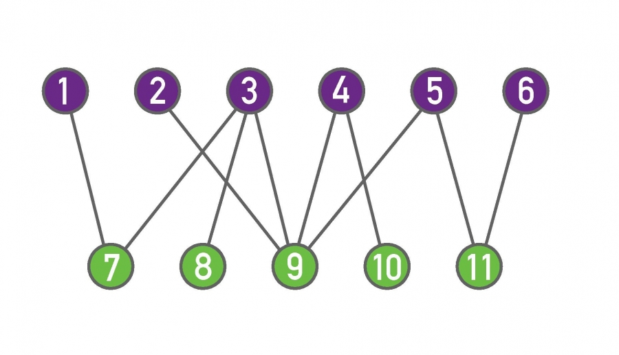

# Homework

## Königsberg Problem

**Which of the icons in Image 2.19 can be drawn without raising yourpencil from the paper, and without drawing any line more than once? Why?**

## Matrix Formalism

Let A be the NxN adjacency matrix of an undirected unweighted network, without self-loops. Let 1 be a column vector of N elements, all equal to 1. In other words 1 = (1, 1, ..., 1)T , where the superscript T indicates the transpose operation. **Use the matrix formalism (multiplicative constants, multiplication row by column, matrix operations like transpose and trace, etc, but avoid the sum symbol Σ) to write expressions for:**

- **The vector k** whose elements are the degrees ki of all nodes i = 1, 2,..., N.
- **The total number of links, L,** in the network.
- **The number of triangles T present in the network,** where a triangle means three nodes, each connected by links to the other two (Hint: you can use the trace of a matrix).
- **The vector $k_{nn}$** whose element i is the sum of the degrees of node i's neighbors.
- **The vector $k_{nnn}$** whose element i is the sum of the degrees of node i's second neighbors.

## Graph Representation

The adjacency matrix is a useful graph representation for many analytical calculations. However, when we need to store a network in a computer, we can save computer memory by offering the list of links in a Lx2 matrix, whose rows contain the starting and end point i and j of each link. Construct for the networks (a) and (b) I made in 2.20:

Undirected graph of 6 nodes and 7 links. Directed graph of 6 nodes and 8 directed links.

- **The corresponding adjacency matrices.**
- **The corresponding link lists.**
- Determine **the average clustering coefficient of the network** shown in Image 2.20a
- If you switch the labels of nodes 5 and 6 in Image 2.20a, **how does that move change the adjacency matrix? And the link list?**
- **What kind of information can you not infer from the link list representation** of the network that you can infer from the adjacency matrix?
- In the (a) network, how many paths (with possible repetition of nodes and links) of length 3 exist starting from node 1 and ending at node 3? And in (b)?
- With the help of a computer, count the number of cycles of length 4 in both networks.

## Degree, Clustering Coefficient and Components

Consider an undirected network of size N in which each node has degree k = 1.

- **Which condition does N have to satisfy?**
- **What is the degree distribution of this network?**
- **How many components does the network have?**

Consider now a network in which each node has degree k = 2 and clustering coefficient C = 1.

- **How does the network look like?**
- **What condition does N satisfy in this case?**

## Bipartite Networks

Consider the bipartite network of Image 2.21

Bipartite network with 6 nodes in one set and 5 nodes in the other, connected by 10 links.

- **Construct its adjacency matrix. Why is it a block-diagonal matrix?**
- **Construct the adjacency matrix of its two projections, on the purple and on the green nodes, respectively.**
- **Calculate the average degree of the purple nodes and the average degree of the green nodes in the bipartite network.**
- **Calculate the average degree in each of the two network projections. Is it surprising that the values are different from those obtained in point (c)?**

## Bipartite Networks - General Considerations

Consider a bipartite network with $N_1$ and $N_2$ nodes in the two sets.

- What is the maximum number of links $L_{max}$ the network can have?
- How many links cannot occur compared to a non-bipartite network of size $N = N_1 + N_2$ ?
- If $N_1<<N_2$ , what can you say about the network density, that is the total number of links over the maximum number of links, $L_{max}$?
- Find an expression connecting N1, N2 and the average degree for the two sets in the bipartite network, $〈k_1〉$ and $〈k_2〉$.
