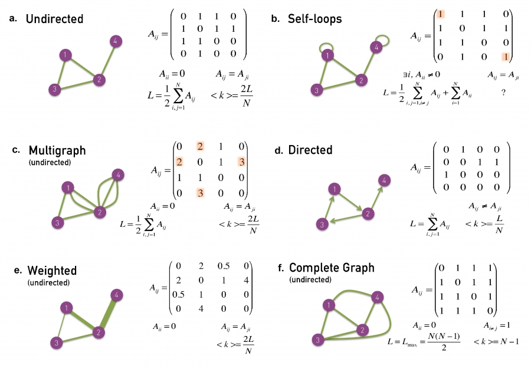
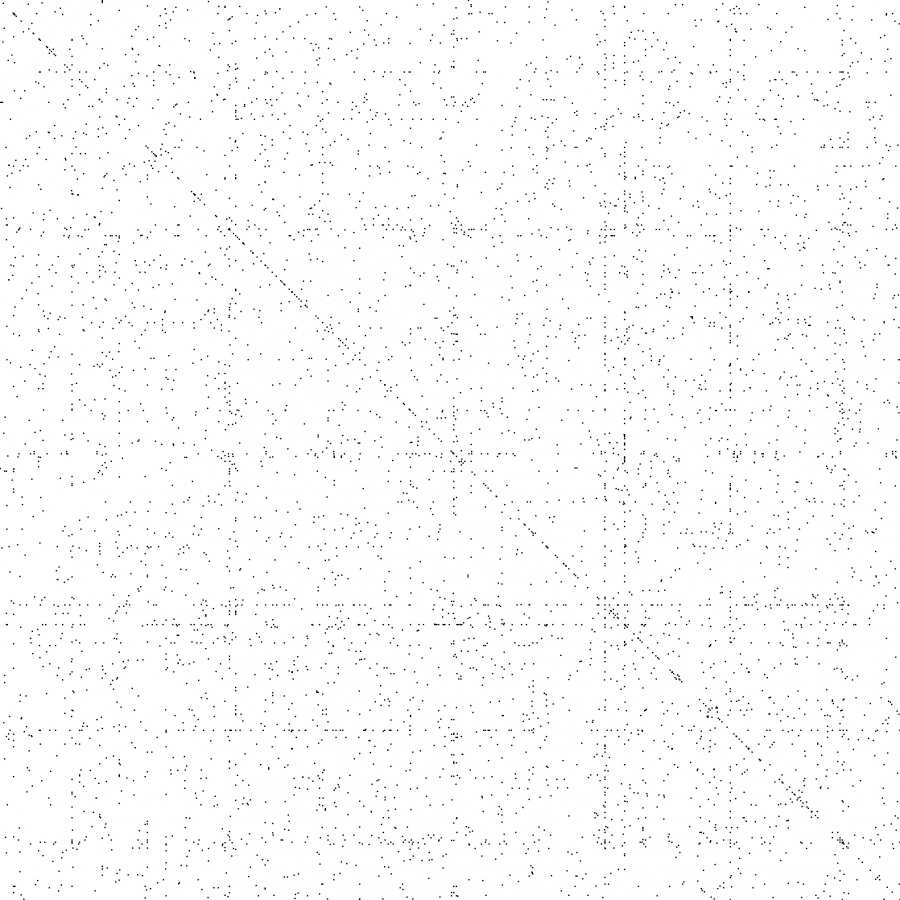
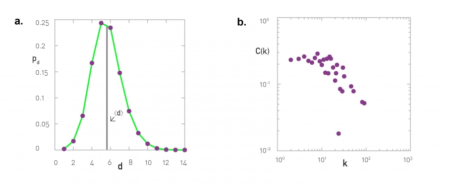

# Section 2.1 The Bridges of Königsberg

グラフ理論の起こり：1735 年のケーニヒスベルグとオイラーの解法
二つの重要な示唆

- グラフにすると簡単な問題に還元できる問題がある
- グラフ、ネットワークには固有の性質がある

# Section 2.2 Networks and Graphs

A network is a catalog of a system’s components often called nodes or vertices and the direct interactions between them, called links or edges

**有向グラフと無向グラフ**

ネットワークは以下のいずれか：

- WWW、電話の発信は有向グラフ：すべてのエッジ(リンク)が矢印
- romantic tie 、transmission lines on the power grid は無向グラフ：すべてのエッジが非矢印
- 代謝ネットワークは有向エッジもそうでないエッジ(双方向または無向)も含む

自然現象からネットワークを抽出する方法が、解ける問いを決める。破綻のないネットワークが組め、ネットワーク科学の知見を適用できるが、意味のないリンクがありうる（例：同じ苗字のネットワーク）。

- 仕事場でのネットワーク →plays a key role in the success of a company or an institution, and is of major interest to organizational research
- 友達関係のネットワーク →plays an important role in the spread of ideas, products and habits and is of major interest to sociology, marketing and health sciences.
- 恋人関係のネットワーク →of key importance for the spread of sexually transmitted diseases, like AIDS, and of major interest for epidemiology.
- 電話やメールで繋がる人間関係のネットワーク →capturing a mixture of professional, friendship or intimate links, of importance to communications and marketing.

* [ネットワーク科学とグラフ理論の用語整理（各行が同じ意味）](./terminology.tsv)
* [頻繁に出てくるネットワーク(canonical datasets)](./canonical-datasets.tsv)

# Section 2.3-10 ネットワークの性質を測る指標

## キーワード

- Section 2.3 - 次数、平均次数、次数分布
- Section 2.4 - 隣接行列
- Section 2.7 - 二部グラフ
- Section 2.8 - パス、パス長、距離(測地線)、ネットワーク直径
- Section 2.8 その他のキーワード - Euler 路、Hamilton 路
- Section 2.9 - 連結性、連結、非連結
- Section 2.10 - クラスター係数、平均クラスター係数
- Advanced Topic 2.A - グローバルクラスター係数

## Section 2.3 Degree, Average Degree and Degree Distribution

次数分布が一番重要。べき分布（スケールフリーネットワーク）の発見以来最も重要になった。

- ネットワークの性質を調べる指標には大抵$`p_k`$を使う
- 次数分布の precise functional form (よくわかラズ) がインターネットの堅牢性やウイルスの広がりなどいろんな現象を規定している
  。各 $`p_k`$は規格化された次数。つまり次数をノード数 N で割るだけで良い。

[8] A.-L. Barabási and R. Albert. Emergence of scaling in random networks. Science, 286:509–512, 1999.

$$
\sum_{\mathrm{k}=1}^{\infty} \mathrm{p}_{\mathrm{k}}=1
$$

次数：有向グラフの場合は in と out を区別するので、1/2 が外れる。

$$
\mathrm{L}=\frac{1}{2} \sum_{\mathrm{i}=1}^{\mathrm{N}} \mathrm{k}_{\mathrm{i}}
$$

平均次数：

$$
\langle k\rangle=\frac{1}{N} \sum_{i=1}^N k_i=\frac{2 L}{N}
$$

A layout of the protein interaction network of yeast (Table 2.1). Each node corresponds to a yeast protein and links correspond to experimentally detected binding interactions. Note that the proteins shown on the bottom have self-loops, hence for them k=2.
The degree distribution of the protein interaction network shown in (a). The observed degrees vary between k=0 (isolated nodes) and k=92, which is the degree of the most connected node, called a hub. There are also wide differences in the number of nodes with different degrees: Almost half of the nodes have degree one (i.e. p1=0.48), while we have only one copy of the biggest node (i.e. p92 = 1/N=0.0005).
The degree distribution is often shown on a log-log plot, in which we either plot log pk in function of ln k, or, as we do in (c), or we use logarithmic axes. The advantages of this representation are discussed in Chapter 4.

## Section 2.4 Adjacency Matrix

ノード j がノード i を指している時に i 行めの j 列めを 1 とし、そうでない時に 0 とすると、ネットワークを行列で表すことができるので、これを「隣接行列」と呼ぶ。
ノード i の次数は i を含む行か列を足し合わせていけばいい。（有向グラフの時は行の和が $`k_in`$　、列の和が $`k_out`$ になる）
重要な式はすべて下の図にまとまっている。

## Section 2.7 Bipartite Networks

ノードたちを二つのグループに分けて、それぞれのグループ内のノードが同じグループ内の別なノードを指さないように分けられる時「二部グラフ」という（そのような 3 つ以上で初めて分けられるときは「多部グラフ」）

これはいろんなグラフで現れる

- 俳優と映画のネットワーク
- 病気とそれを引き起こす中心遺伝子のネットワーク [ここ](https://archive.nytimes.com/www.nytimes.com/interactive/2008/05/05/science/20080506_DISEASE.html?ref=health)からもっと細かい図が見られる

多部グラフの例としては

- レシピと食材と化合物のネットワーク

がある。

二部グラフ（多部グラフでも）では、Projection「射影」が取れて、二つのノードが同じノードとリンクしているときにそのノード間にリンクを作るもの。

## Section 2.8 Paths and Distances

ネットワークでは物理的な距離は意味がない。パス長を考えて、その中で最短のものを「距離」と呼ぶことにする。（数学的には、そのような経路は Geodesic path「測地線」と呼ばれる。）また、距離の最大値をネットワークの「直径」と呼ぶ。

- a:ノード 1 と 6 をむすぶある経路（オレンジ）のパス長は 5（距離は 3）
- b:ノード 1 と 7 の距離は 3
- このグラフの直径は 3。

最短パス長を見つけるのは大きなネットワークだと難しいが、ノード i と j の間の距離を与える**経路の本数が隣接行列からもとまる**ため、ノード i と j の間の**距離は隣接行列からもとまる**

他に経路関係で重要なキーワード

- Euler 路：すべてのリンクを一回のみ通るパス（一筆書き）
- Hamilton 路：すべてのノードを一回のみ通るパス

## Section 2.9 Connectedness

ネットワーク中のノード i から j に行く経路があるときに「連結」、そうでなければ「非連結」という（ij 間の距離は $`\infty`$ ）。
グラフ全体が連結かどうかは隣接行列からすぐわかる。

グラフが二つのクラスターに分けた時にその間をつなぐリンクを bridge という

- 隣接行列を行や列を並び替えて区分行列になるなら、それぞれが非連結なクラスターに分かれる。
  - [隣接行列が区分行列かどうかを判定する方法]()
  - [隣接行列が区分行列かどうかを判定する python ライブラリ]()
    うまく見つからなかった

Barabasi が書いていた方法は、
適当なノード i をとり、BFS でラベル付けする → もしラベルの総数がノード数と一致していれば連結。

## Section 2.10 Clustering Coefficient

あるノードの隣接ノードの接続度合いを測る指標が「クラスター係数」で、0 から 1 の値を取る。
次数 $`k_i`$ のノード i にリンクしているノード間のリンク数の総和を $`L_i`$ とすると、
クラスター係数は

$$
\mathrm{C}_{\mathrm{i}}=\frac{2 \mathrm{~L}_{\mathrm{i}}}{\mathrm{k}_{\mathrm{i}}\left(\mathrm{k}_{\mathrm{i}}-1\right)}
$$

- クラスター係数は隣接しているノードが繋がっている確率である
  （図を見るとおかしいように見えるが、全部のペアを考えることに注意。四面体でかくとわかりやすい）
  

平均クラスター係数と、ネットワーク全体のクラスター係数（グローバルクラスター係数）

$$
\langle\mathrm{C}\rangle=\frac{1}{\mathrm{~N}} \sum_{\mathrm{i}=1}^{\mathrm{N}} \mathrm{C}_{\mathrm{i}}
$$

# Section 2.5 Real Networks are Sparse

実世界のネットワークは非常に疎になっている

# Section 2.6 Weighted Networks

この本で取り扱うグラフは、ほとんどが重みなしネットワーク。
科学で取り扱うグラフは多くが重みありネットワークだが、実際に重みが測れることは少ないため重みなしネットワークを仮定することは多い。
ただし、今分析しているネットワークの重みを持ったバージョンを考えた時に性質が変わるのかどうかは常に気をつけたほうがいい。

[Metcalfe の法則(1990s)](https://ja.wikipedia.org/wiki/%E3%83%A1%E3%83%88%E3%82%AB%E3%83%BC%E3%83%95%E3%81%AE%E6%B3%95%E5%89%87)

[9] G. Gilder. Metcalfe’s law and legacy. Forbes ASAP, 1993.
メトカーフの法則は $` L_{max} ~ N^2 `$ からきているが、妥当性は限定的である：

- 実際のネットワークは疎のため、実際にはノードの増加はリンクの増加と線形
- 実際のネットワークは重みがあり、非常によく使われるリンクとそうでないリンクがある。

# Section 2.11 Summary

具体的にイーストのタンパク質の例からそれぞれの値を出してみている。

特筆すべきこととして、次数の分布は 6 前後にピークが来ること。6 次の隔たりを想起させる。
まとめられれば良いと思う
