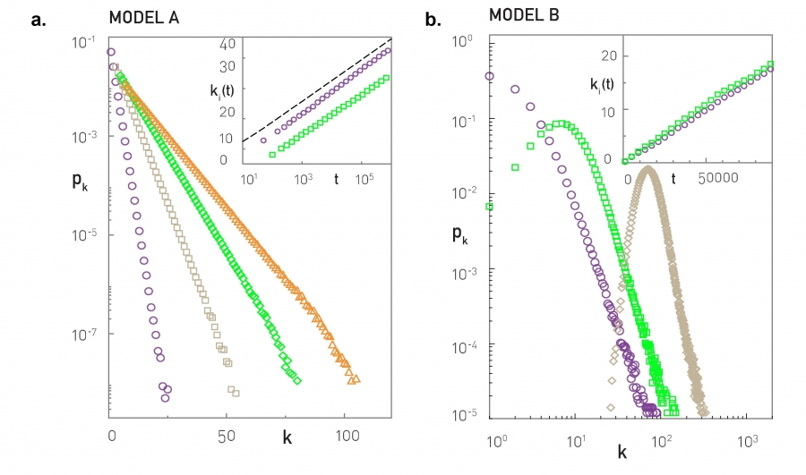

# 5 The Barabási-Albert Model

## 5.1 Introduction

WWWや細胞の代謝ネットワークなどの全く異なるシステムが，同じようなスケールフリーアーキテクチャに収束するのはなぜか?  
スケールフリー特性の出現に関わるメカニズムがこの章の主要なトピック

## 5.2 Growth and Preferential Attachment

ランダムネットワークにはハブとべき乗則が存在しない  
以下のような特徴がないのが大きい  
・成長：現実のネットワークは，ノード数 $N$ を継続的に増加させる成長プロセスの結果  
・優先的選択：現実のネットワークでは，新しいノードはより接続されているノードにリンクする傾向  
例）　WWW，論文，映画俳優

## 5.3 The Barabási-Albert Model

Barabási-Albertモデル（別名：BA モデル，スケールフリーモデル）  
優先的選択として，ノード $i$ に接続する確率を次数 $k_i$ により決定
$$\Pi (k_i ) = \frac{{k_i }}{{\sum\limits_j {k_j } }} \hspace{20 mm} (5 . 1)
$$
べき乗則とハブの起源は，成長と優先的選択の共存によって引き起こされる，富む者が更に富む現象

## 5.4 Degree Dynamics

古いノードが若いノードよりも有利になり，最終的にはハブに  
$β$ はdynamical exponentと呼ばれ，$\frac{1}{2}$ である  
・すべてのノードは同じ動的法則に従う  
・度数の増加は線形未満（$β<1$）．新しいノードのリンクより既存ノードの方が多く奪い合いになるため  

## 5.5 Degree Distribution

Barabási-Albertモデルはdegree exponent $γ=3$ のスケールフリーネットワークを生成
$$p(k) \approx 2m^{1/\beta } k^{ - \gamma }  \hspace{20 mm} (5 . 9)
$$

**a.** $\: m_0=m=1 \text{(blue)}, \, 3 \text{(green)}, \, 5 \text{(grey)}, \text{and} \; 7 \text{(orange)}$  
各色が平行である事実は，$γ$ が $m$ および $m_0$ から独立していることを示す  
紫色の線の傾きは $-3$ で，degree exponent $γ=3$ に対応

## 5.6 The Absence of Growth or Preferential Attachment

スケールフリー特性の出現には，成長と優先的選択の両方とも必要なのか?

**a.** 成長のみ．$m_0=m=1 \text{(circles)}, \, 3 \text{(squares)}, \, 5 \text{(diamonds)}, \text{and} \; 7 \text{(triangles)} $  
すべてのノードが等しい確率でリンクを取得するため，富豪になるプロセスが欠けている  
**b.** 優先的選択のみ．$ t=N \text{(circles)}, \, 5N \text{(squares)}, \text{and} \; 40N \text{(diamonds)}$  
定常性が失われ，ネットワークが完全なグラフに収束することになる  

## 5.7 Measuring Preferential Attachment

## 5.8 Non-linear Preferential Attachment

## 5.9 The Origins of Preferential Attachment

## 5.10 Diameter and Clustering Coefficient

## 5.11 Summary