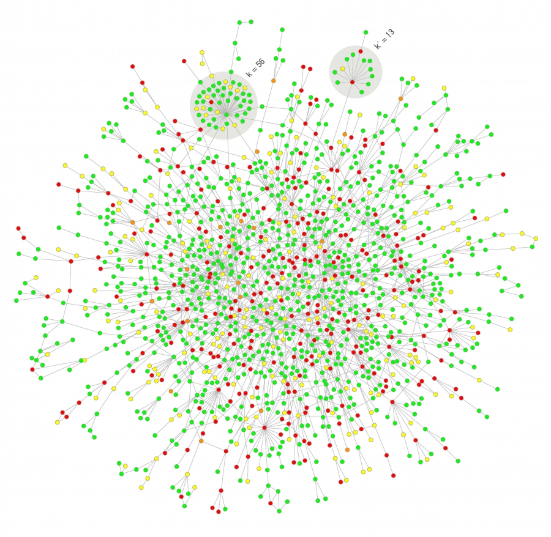
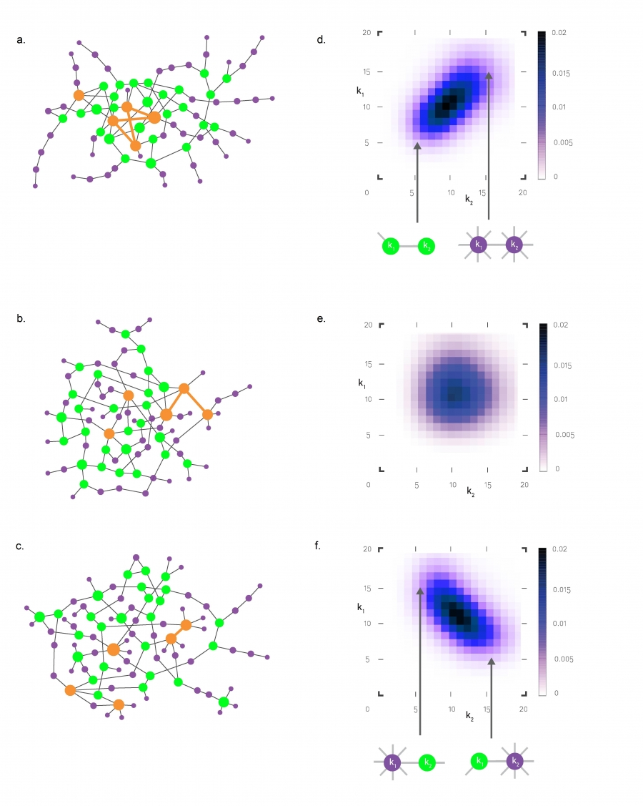
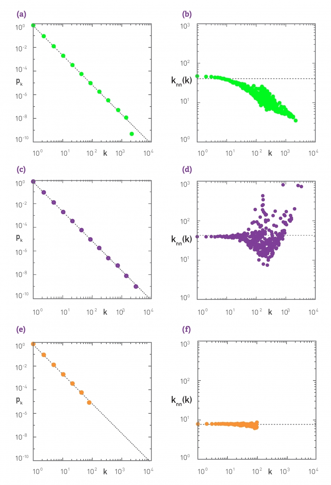
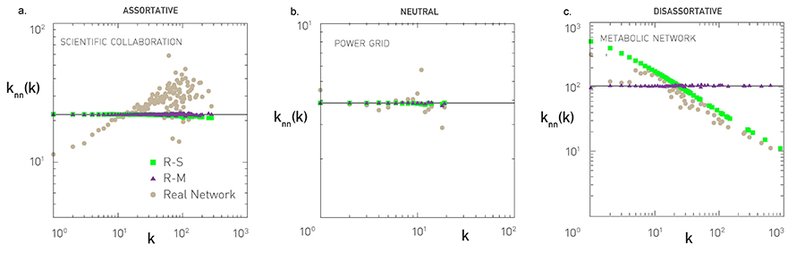
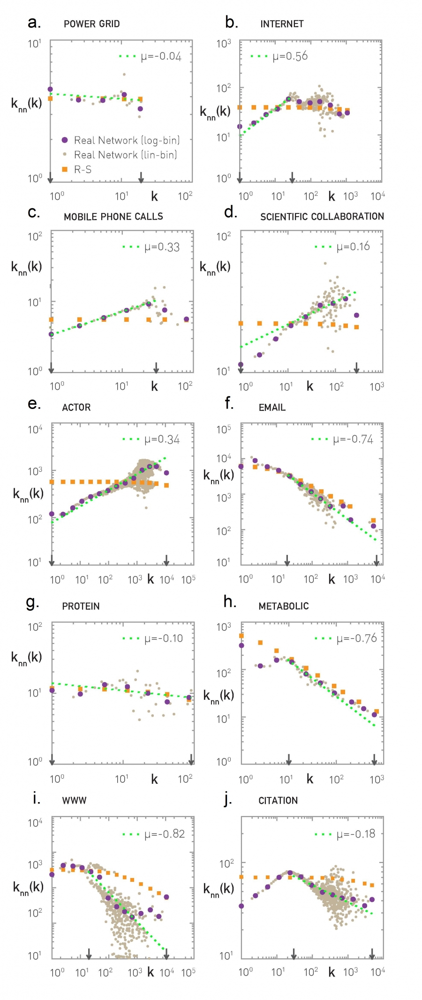
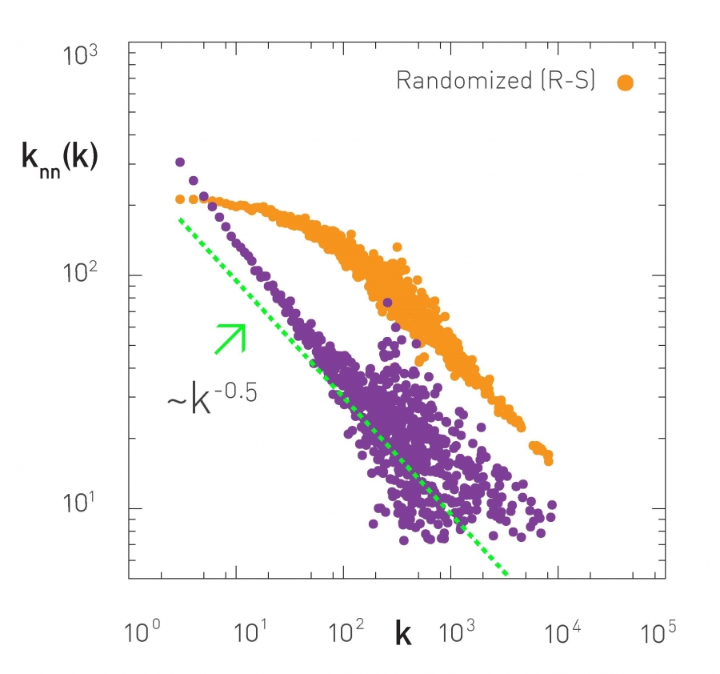
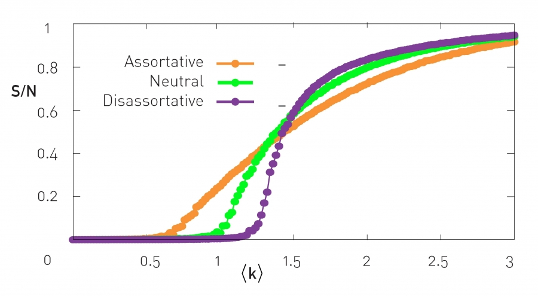
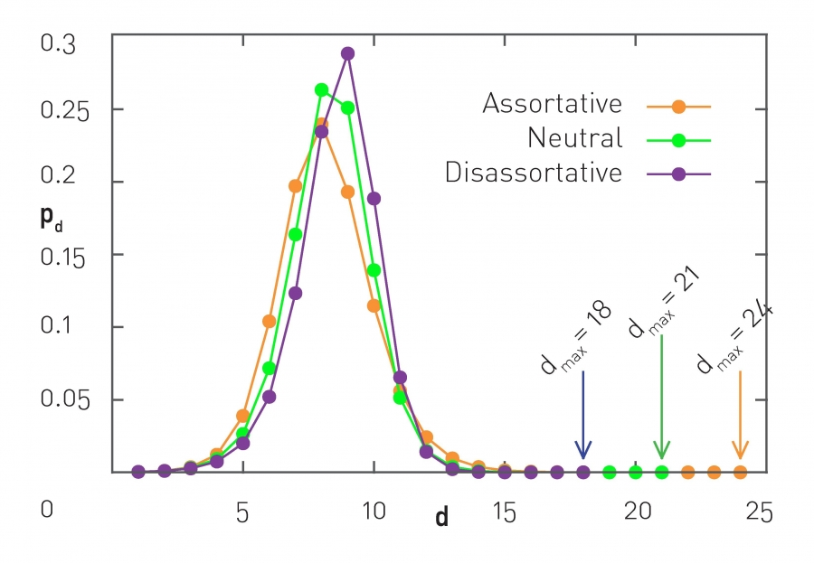
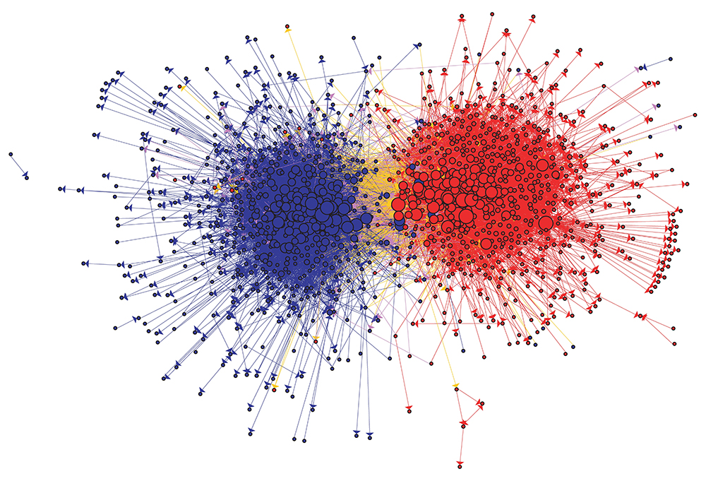

# 次数相関
# Section 7.1 Introduction
著名人が著名人と結婚することは"普通"なのか？
ある著名人が、1億人(10^8)の中から1000人(10^3)の著名人リストにのる人物と結婚する可能性は、ランダムにやると10^-5しかない。

→ **HubはHubとつながる**という興味深い事実

ランダムに繋がるノードを選ぶ場合であれば、次数kとk'のノードがつながっている確率は、

$$p_{k,k'}  = \frac{{kk'}}{{2L}} \hspace{20 mm} (7 . 1)$$

なので、Lが一定だから次数が高いノード間ほど繋がりやすい。

この構造はタンパク質相互作用ネットワーク(例えばイースト菌)では見られない。具体的には、いくつかのハブはあるものの、大部分は1か2のリンクしか持ってないし、ハブ同士が繋がっていない。

→ イースト菌のタンパク質相互作用ネットワークにおいて、ハブ同士が繋がっていないのは普通ではない。

一般の実ネットワークで見られる **「次数相関」** という現象について見ていく

# Section 7.2 Assortativity and Disassortativity
Assortativity とは=どれくらい次数の近いノード同士がリンクしているか
ネットワークにおける次数の相関関係を定義することができる

まずは視覚的に見てみよう

- 不偏ネットワーク(a)：ランダムなリンクを形成。 7.1式のようなノード間リンク確率があるため、ハブ同士は連結。
- 同質局在的ネットワーク(b)：
- 異質局在的ネットワーク(c)：

e ij行列の欠点
* 視覚的な情報だけでは情報を抽出しにくい
* 相関の度合いを測れない
* 最大次数の2乗に比例する独立変数があり、数値解析やシミュレーションに不向き

$$ \sum\limits_{i,j} {e_{ij} }  = 1 \hspace{20 mm} (7 . 2)$$
$$q_k  = \frac{{kp_k }}{{\left\langle k \right\rangle }} \hspace{20 mm} (7 . 3)$$
$$\sum\limits_j {e_{ij}  = q_i }  \hspace{20 mm} (7 . 4)$$
$$e_{ij}  = q_i q_j  \hspace{20 mm} (7 . 5)$$

# Section 7.3 Measuring Degree Correlations
隣接ノードの平均次数を計算する

$$k_{nn} (k_i ) = \frac{1}{{k_i }}\sum\limits_{j = 1}^N {A_{ij} k_j }  \hspace{20 mm} (7 . 6)$$

次数相関関数は、ある次数の全ノードに対して(7.6)を計算したもの

$$k_{nn} (k) = \sum\limits_{k'} {k'} P(k'|k) \hspace{20 mm} (7 . 7)$$

$$P(k'|k) = \frac{{e_{kk'} }}{{\sum\limits_{k'} {e_{kk'} } }} = \frac{{e_{kk'} }}{{q_k }} = \frac{{q_{k'} q_k }}{{q_k }} = q_{k'}  \ hspace{20 mm} (7 . 8)$$

neutral networkでは、
$$k_{nn} (k) = \sum\limits_{k'} {k'q_{k'}  = \sum\limits_{k'} {k'\frac{{k'p(k')}}{{\left\langle k \right\rangle }} = \frac{{\left\langle {k^2 } \right\rangle }}{k}} }  \hspace{20 mm} (7 . 9)$$

→friendship paradox

両対数グラフで直線に見える→べきで近似

$$k_{nn} (k) = ak^\mu   \hspace{20 mm} (7 . 10)$$

**Assortatvityとは、$ \mu $　の正負**

- Assortative Networks: μ > 0
- Neutral Networks: μ = 0
- Disassortative Networks: μ < 0

- Collaboration Network
- Power Grid
- Metabolic Network

# Section 7.4 Structural Cutoffs

この本では、ネットワークが"simple"であることを仮定
＝無向グラフで、リンクは1本
→スケールフリーネットワークの性質と、assortativityは矛盾する
スケールフリーネットワークでは、 $e_{ij}  = q_i q_j (7 . 5)$ と $q_k  = \frac{{kp_k }}{{\left\langle k \right\rangle }} (7 . 3)$ から

$$E_{kk'}  = e_{kk'} \left\langle k \right\rangle N \hspace{20 mm} (7 . 13)$$

が

$$E_{kk'}  = \frac{{kp_k k'p_{k'} }}{{\left\langle k \right\rangle }}N = \frac{{\frac{{55}}{{300}}\frac{{46}}{{300}}}}{3}300 = 2.8 \hspace{20 mm} (7 . 14)$$

のはずだから、期待されるノード間のリンク数は2.8 ←→シンプルネットワークでは1本しかリンクが持てない(Structural Cutoff)
スケールフリー性が壊れる(Structural Disassortativity)
cf. image7.8a,b

ちなみに、kが小さければ(7.14)が1を超えることがないので、この問題は起きない

→臨界点となる次数ksが存在する

$$k_s (N) \sim \left( {\left\langle k \right\rangle N} \right)^{1/2}  \hspace{20 mm} (7 . 15)$$

ここから、臨海次数はおおよそNの平方根に比例することがわかる

$k_{max}$ (natural cutoff)と $k_s$ を比較することで、structural cutoff が起きるのかどうかがわかる。

**回避する方法**
* そもそもγ>=3ならkmax<ks
* ノード間に複数のリンクを許す(image7.8cd)
* 次数がks以上のハブノードを取りのぞく(image 7.8f)

**判定する方法**
ネットワークのassortativityが、それがstructuralなものか、他に原因がちゃんとあるのかはどうやったらわかるのか？

→次数保存ランダム化（単一リンクの場合と複数リンクの場合）

単一リンクしか許さずランダムに繋ぎかえ(R-S)たネットワークでも隣接ノード次数が変わらなかったらstructural disassortativity
※複数リンクも許す場合(R-M)は、次数相関が常に消えるはず。

- No Stuctural Cutoff
- Stuctural Disassortativity

# Section 7.5 Correlations in Real Networks

いろんなネットワークに対して次数相関を見てみる

- Power Grid
- Internet
* Social Networks
* Email Network
* Biological Networks
* WWW
* Citation Network

# Section 7.6 Generating Correlated Networks
$$k_{nn} (k) \sim k^{ - 1}  \hspace{20 mm} (7 . 16)$$

**次数相関によってネットワークはどう変わるか？**
まず、任意の次数相関を持つネットワークは作れるか？について考える。
## 静的生成モデル（Static modelの場合）
* Erdős-Rényi Model
* Configuration Model
* Hidden Parameter Model
## 動的生成モデル（evolving networkの場合）
* Initial Attractiveness Model
    - Weak Assortativity: γ > 3
    $$k_{nn} (k) \sim m\frac{{(m + A)^{1 - \frac{A}{m}} }}{{2m + A}}\zeta \left( {\frac{{2m}}{{2m + A}}} \right)N^{\frac{A}{{2m + A}}} k^{\frac{A}{m}}  \hspace{20 mm} (7 . 17)$$
    $$k_{nn} (k) \sim k^{\frac{{|A|}}{m}}  \hspace{20 mm} (7 . 18)$$

    - Neutral Regime: γ = 3
    $$k_{nn} (k) \sim \frac{m}{2}\ln N \hspace{20 mm} (7 . 19)$$

    - Weak Assortativity: γ > 3
    $$k_{nn} (k) \approx (m + A)\ln \left( {\frac{k}{{m + A}}} \right) \hspace{20 mm} (7 . 20)$$

* Bianconi-Barabási Model

## 次数相関をいじる
Xalvi-Brunet and Sokolov algorithm
→詳しくは本編を見て

# Section 7.7 The Impact of Degree Correlations
次数相関によってネットワークはどう変わるか？ネットワークのどのようなパラメータに影響を与えるのか？
* 相転移が発生する平均次数が変化する
    * Assortativeだとより小さく、Disassortativeだとより大きい平均次数から発生するようになる。
    * assortativeネットワークだとネットワークが頑健になる
    * disassortativeネットワークだとエピデミックの確率を減らせる
* 経路長が変化する
    * assortativeなほど平均経路長が短くなる
    * assortativeなほどネットワーク直径が長くなる
その他にもassortativeだとネットワークがどういう性質を持つのかいろいろ研究されている（刺激や撹乱に対する耐性、頂点被覆問題、ネットワーク支配可能性）

* Assortative Networks
* Disassortative Networks
* Giant Component

# Section 7.8 Summary

# 
みんなにプルリクしてもらい、整備する