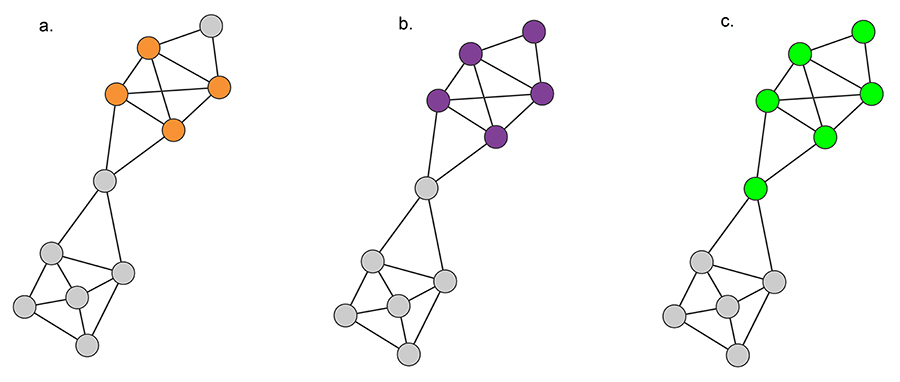
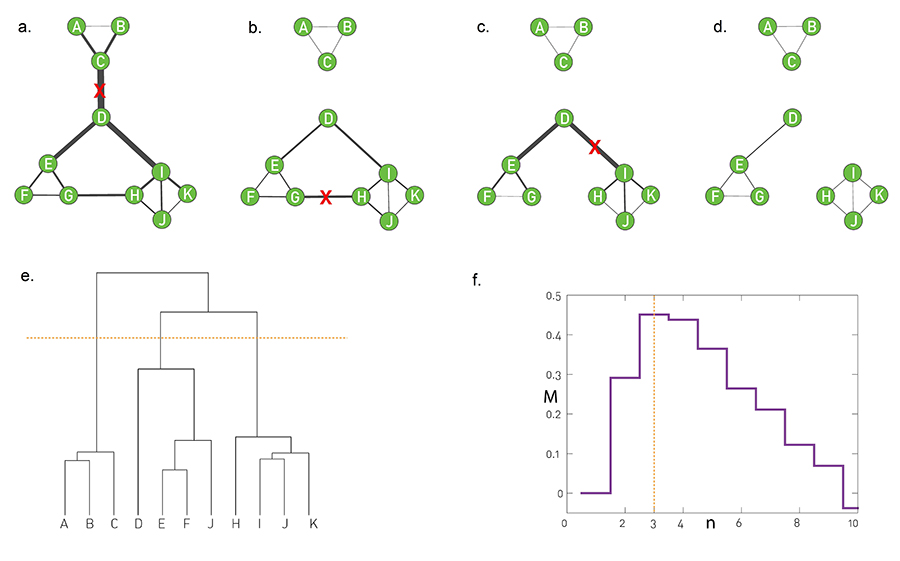
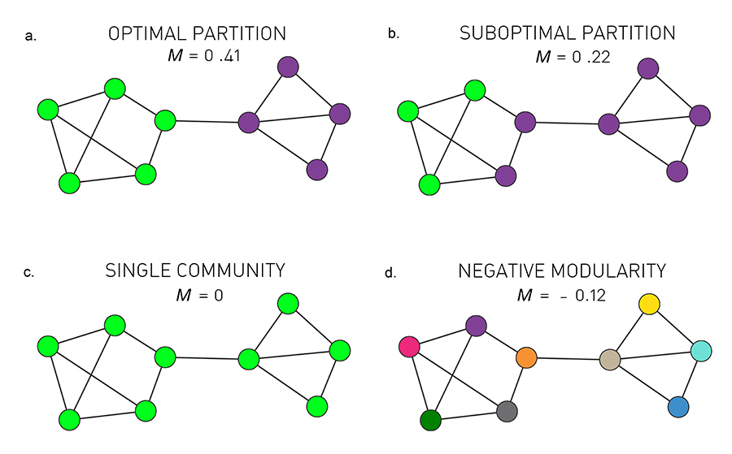
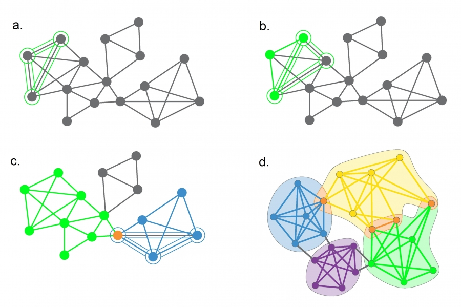
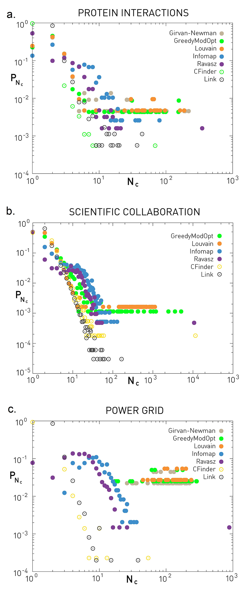
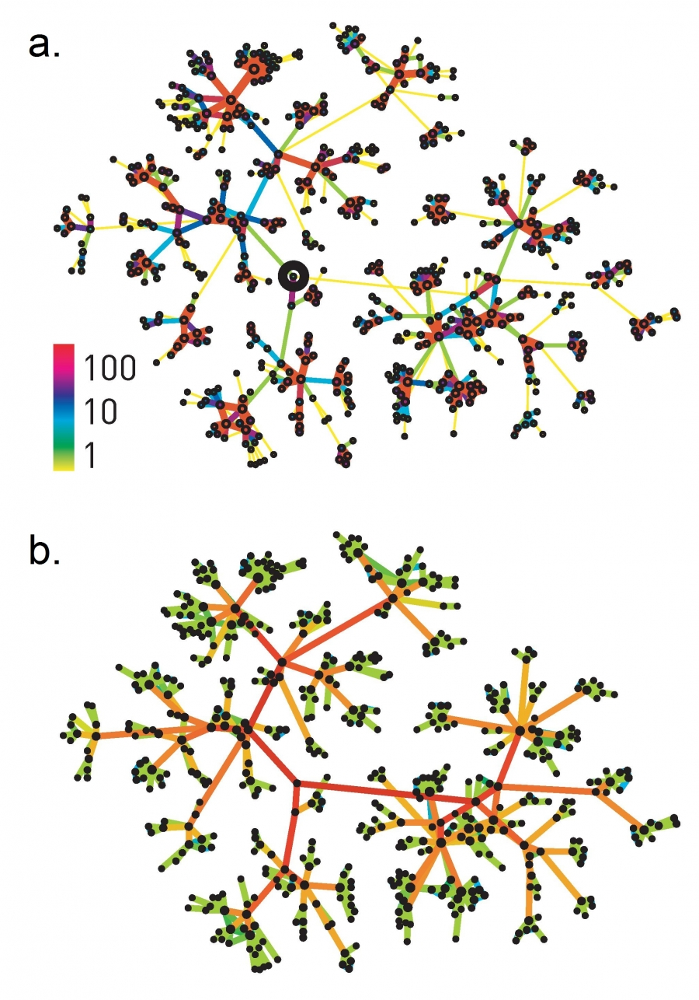

# 9 Communities
summerised by [Yatima Kagurazaka](https://twitter.com/Yatima_K)

## 9.1 Introduction

コミュニティの存在は、誰が誰とつながっているかに根ざしているため、度数分布だけでは説明できない  
この章の目的は、複雑なネットワークのコミュニティ構造を理解して特定するために必要な概念を紹介すること  

H1: 基礎となる仮説  
ネットワークのコミュニティ構造は、配線図内で一意にエンコードされる。  

仮説の着想となった実例  
- ベルギーの通話記録では，フランス語話者とオランダ語話者でコミュニティが二分されている  
- Zachary空手クラブで，クラブの会長とインストラクターの間の対立により、クラブは2つに分裂  
- 大腸菌のタンパク質代謝ネットワーク  

## 9.2 Basics of Communities

H2: 接続性と密度の仮説  
コミュニティは、ネットワーク内の局所的に密に接続されたサブグラフである。  
※　ある程度本質に迫る仮説だが，一意に定義できるものではない  
  
いくつかの定義  
最大クリーク：メンバー全員がお互いを知っている個人のグループ（下図a）  
- ネットワークにおいて三角形のクリークは頻繁に現れるが，それより大きいものはまれ  
- 制約が厳しすぎる．9.1節の2,3番目の例は検出できない  

強いコミュニティ：外部ノードよりも内部ノードへのリンクを多く持つノード同士のサブグラフ（下図b）  
$$k_i^{{\mathop{\rm int}} } (C) > k_i^{ext} (C) \hspace{20 mm} (9 . 1)
$$  
弱いコミュニティ：内部次数の合計が外部次数の合計を超えるサブグラフ（下図c）  
$$\sum\limits_{i \in C} {k_i^{{\mathop{\rm int}} } (C)}  > \sum\limits_{i \in C} {k_i^{ext} (C)}  \hspace{20 mm} (9 . 2)$$  

  
コミュニティの分割パターンは指数関数より速く増加するため，効率の良いアルゴリズムが必要  
（ブルートフォースだと $100$ ノードを半々にする場合 $10^{16}$ 年かかる）  

## 9.3 Hierarchical Clustering
実行時間が $N$ に応じて多項式的に増加するアルゴリズム
  
凝集的アプローチ: Ravasz アルゴリズム  
類似性の高いノードを同じコミュニティにマージ  
1. 類似性行列を定義  
2. グループの類似性決定  
3. 階層的クラスタリングを適用  
4. 樹状図化  

$o(N^2) + o(N^2) + o(NlogN)$ であり， $o(e^N)$ の総当りよりはるかに高速  

分裂的アプローチ: Girvan-Newman アルゴリズム  
類似性の低いリンクを削除してコミュニティを分離  
  

  
中心性（基本的にはアルゴリズムが高速となるbetweenness）の高いものから削除  
計算量は $o(L^2N)$ ，疎なネットワークなら $o(N^3)$ 

## 9.4 Modularity
モジュラリティは，ランダムな構成からの系統的な偏差を利用し、各パーティションの質を定量化  
$$M = \sum\limits_{c = 1}^{n_c } {\left[ {\frac{{L_c }}{L} - \left( {\frac{{k_c }}{{2L}}} \right)^2 } \right]}  \hspace{20 mm} (9 . 12)$$
  

モジュラリティベースのアルゴリズム：最適化貪欲法，Louvain法（貪欲法については原著参照）  
限界：モジュラリティを最大化しようとすると，以下を満たすコミュニティは検出できなくなってしまう  
$$k \le \sqrt {2L}  \hspace{20 mm} (9 . 14)$$

## 9.5 Overlapping Communities
前の節でのアルゴリズムは，ノードごとに単一のコミュニティのみ割り当てられていたが，実際は並列や入れ子状に複数コミュニティに属することが多い
  
クリークパーコレーションアルゴリズム (CFinder)

前の三角形と1つのリンクを共有するように、ネットワーク全体に三角形を転がしていく  
  
リンククラスタリング  
ノードは複数コミュニティに属しても，リンクは単一コミュニティであることが多いという前提でのアルゴリズム．詳細は原著参照  

## 9.6 Testing Communities
コミュニティ検出の精度と計算効率を評価するための概念

### 正確さ  
  
Girvan-Newman (GN) ベンチマーク  
サイズ $N_c =32$ の $n_c =4$ コミュニティに分割された $N= 128$ ノードで構成
$$\mu  = \frac{{k^{ext} }}{{k^{ext}  + k^{{\mathop{\rm int}} } }} \hspace{20 mm} (9 . 18)$$
  
Lancichinetti-Fortunato-Radicchi (LFR) ベンチマーク  
ノード次数とコミュニティサイズの両方がべき乗則  

### 速度
Name |	Nature |	Comp.
----|----|----
Ravasz |	Hierarchical Agglomerative |	O(N2)
Girvan-Newman |	Hierarchical Divisive |	O(N2)
Greedy Modularity |	Modularity Optimization |	O(N2)
Greedy Modularity (Optimized) |	Modularity Optimization |	O(Nlog2N)
Louvain |	Modularity Optimization |	O(L)
Infomap |	Flow Optimization |	O(NlogN)
Clique Percolation (CFinder) |	Overlapping Communities |	Exp(N)
Link Clustering |	Hierarchical Agglomerative; Overlapping Communities |	O(N2)

## 9.7 Characterizing Communities

a. 携帯電話ネットワーク．重みはおそらく通話時間．異なるコミュニティだと短くなりやすい  
b. 輸送システム．異なるコミュニティ間のほうが輸送量が多くなる  

## 9.8 Summary
開発されたアルゴリズムの多くはソフトウェアとして容易に入手できるが，効率的に使用し解釈するには、アルゴリズムに組み込まれている仮定を理解する必要がある  
  
コミュニティ検出アルゴリズムの限界；
- コミュニティが存在するかどうかにかかわらず、コミュニティを特定しようとする
- 全てのノードをどこかのコミュニティに強制的に所属させる
- 高密度ネットワークでは、高度に重複するコミュニティが多数見られがち．その場合は，仮説の妥当性やアルゴリズムの適切さを再検討すべき．外部次数が内部次数よりも高くなるなど
- コミュニティは時間的に変動することがある．昼夜の通話頻度など